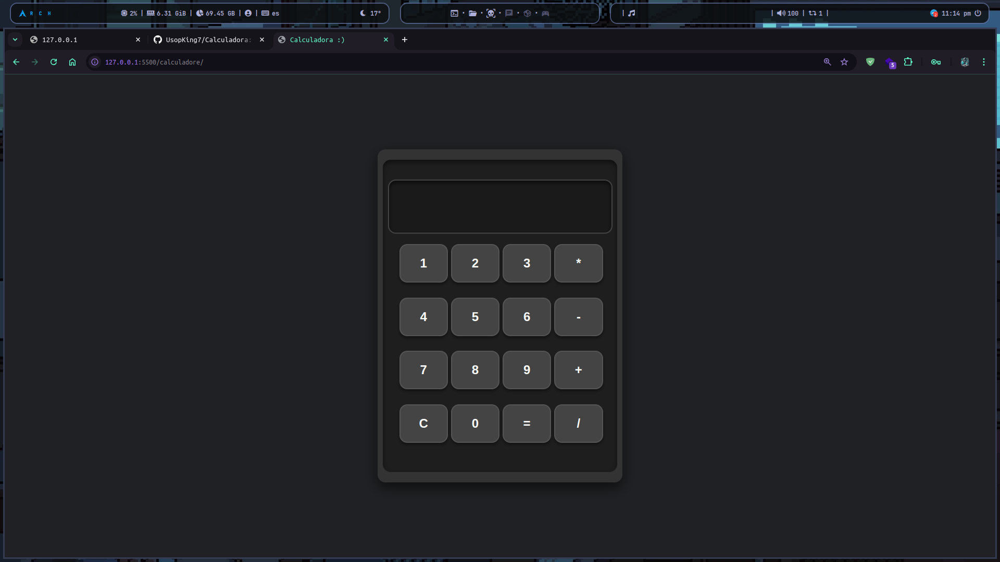

## Calculadora :)

# Pasos para la instalacion
```bash
    git clone https://github.com/UsopKing7/Calculadora.git
```

## Acceder al directorio clonado

```bash
    cd Calculadora
```

## Abrimos nuestro editor de codigo o ID 
en mi caso usare VScode 


## iniciamos nuestro servidor en vscode o entramos directamente al archivo index.html

# Ejemplo de salida



# y ya podremos usar nuestra calculadora codificada en Html Css y JavaScript
## Contribuciones

Las contribuciones son bienvenidas. Si deseas mejorar este proyecto, puedes seguir estos pasos:

1. Haz un fork del repositorio.
2. Crea una rama para tu cambio 
3. Realiza tus cambios y haz commit de ellos 
4. Sube tus cambios a tu fork 
5. Abre un pull request desde tu fork hacia el repositorio original.

## Soporte

Si tienes problemas al utilizar este script o tienes preguntas, no dudes en abrir un **issue** en el repositorio. Nos esforzamos por responder lo antes posible y ayudar a resolver cualquier inconveniente.

## Agradecimientos

Gracias por utilizar este proyecto. Si lo encuentras útil, ¡no dudes en dejar una estrella ⭐ en GitHub!